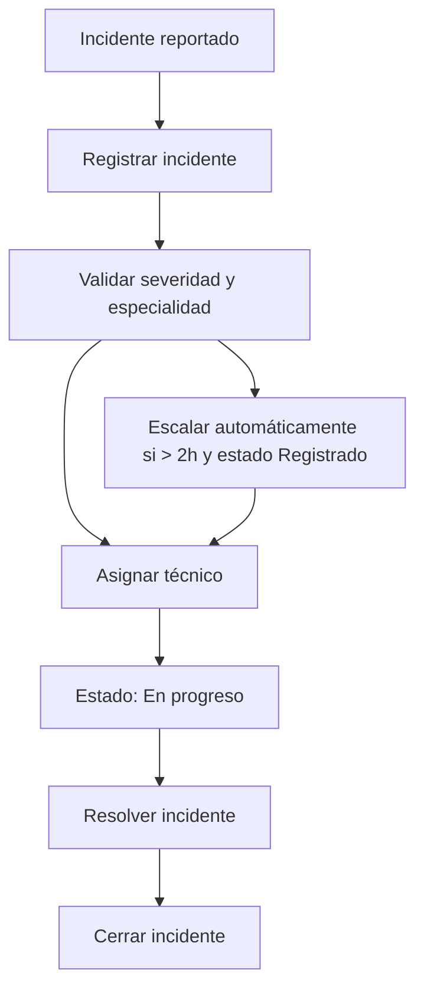
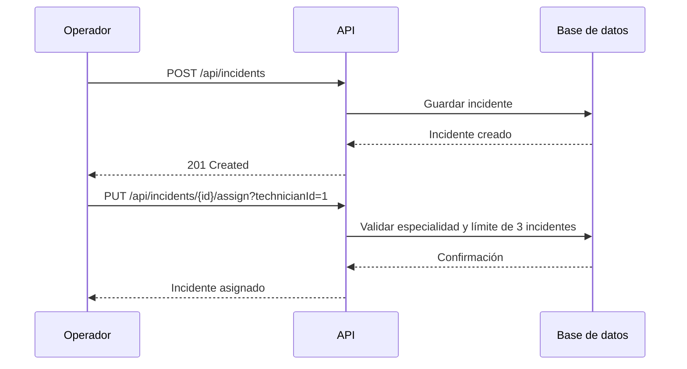

# Diagrama de flujo y secuencia

## Flujo principal de resolución

```mermaid
flowchart TD
    A[Incidente reportado] --> B[Registrar incidente]
    B --> C[Validar severidad y especialidad]
    C --> D[Asignar técnico]
    D --> E[Estado: En progreso]
    E --> F[Resolver incidente]
    F --> G[Cerrar incidente]
    C --> H[Escalar automáticamente si > 2h y estado Registrado]
    H --> D
```

## Diagrama de secuencia simplificado

```mermaid
sequenceDiagram
    participant O as Operador
    participant A as API
    participant B as Base de datos
    O->>A: POST /api/incidents
    A->>B: Guardar incidente
    B-->>A: Incidente creado
    A-->>O: 201 Created
    O->>A: PUT /api/incidents/{id}/assign?technicianId=1
    A->>B: Validar especialidad y límite de 3 incidentes
    B-->>A: Confirmación
    A-->>O: Incidente asignado
```
